# OSAS Connect - Entity Relationship Diagram

```mermaid
erDiagram
    %% Core User Management
    USERS ||--o{ STUDENT_PROFILES : "has"
    USERS ||--o{ OSAS_STAFF_PROFILES : "has"
    USERS ||--o{ ADMIN_PROFILES : "has"
    USERS ||--o{ SCHOLARSHIP_APPLICATIONS : "creates"
    USERS ||--o{ SCHOLARSHIP_NOTIFICATIONS : "receives"
    USERS ||--o{ APPLICATION_COMMENTS : "writes"
    USERS ||--o{ DOCUMENTS : "verifies"
    USERS ||--o{ SCHOLARSHIP_STIPENDS : "processes"
    USERS ||--o{ STAFF_INVITATIONS : "invites"
    USERS ||--o{ SCHOLARSHIP_VERIFICATIONS : "verifies"

    %% Scholarship Management
    SCHOLARSHIPS ||--o{ SCHOLARSHIP_APPLICATIONS : "receives"
    
    %% Application Management
    SCHOLARSHIP_APPLICATIONS ||--o{ DOCUMENTS : "contains"
    SCHOLARSHIP_APPLICATIONS ||--o{ APPLICATION_COMMENTS : "has"
    SCHOLARSHIP_APPLICATIONS ||--o{ INTERVIEWS : "schedules"
    SCHOLARSHIP_APPLICATIONS ||--o{ SCHOLARSHIP_STIPENDS : "generates"
    SCHOLARSHIP_APPLICATIONS ||--o{ SCHOLARSHIP_VERIFICATIONS : "requires"
    SCHOLARSHIP_APPLICATIONS }o--|| USERS : "reviewed_by"
    
    %% Student Profile Relations
    STUDENT_PROFILES ||--o{ SCHOLARSHIP_APPLICATIONS : "applies"

    %% Content Management
    USERS {
        bigint id PK
        string last_name
        string first_name
        string middle_name
        string email UK
        string photo_id
        enum role "admin, osas_staff, student"
        boolean is_active
        timestamp last_login_at
        timestamp email_verified_at
        string password
        string remember_token
        timestamp created_at
        timestamp updated_at
    }

    STUDENT_PROFILES {
        bigint id PK
        bigint user_id FK
        string student_id UK
        string course
        string major
        string year_level
        decimal current_gwa
        enum enrollment_status
        integer units
        string guardian_name
        string existing_scholarships
        string civil_status
        enum sex
        date date_of_birth
        string place_of_birth
        string street
        string barangay
        string city
        string province
        string zip_code
        string mobile_number
        string telephone_number
        boolean is_pwd
        string disability_type
        string religion
        string residence_type
        enum status_of_parents
        string father_name
        integer father_age
        string father_address
        string father_telephone
        string father_mobile
        string father_email
        string father_occupation
        string father_company
        decimal father_monthly_income
        integer father_years_service
        string father_education
        string father_school
        string father_unemployment_reason
        string mother_name
        integer mother_age
        string mother_address
        string mother_telephone
        string mother_mobile
        string mother_email
        string mother_occupation
        string mother_company
        decimal mother_monthly_income
        integer mother_years_service
        string mother_education
        string mother_school
        string mother_unemployment_reason
        integer total_siblings
        json siblings
        decimal combined_annual_pay_parents
        decimal combined_annual_pay_siblings
        decimal income_from_business
        decimal income_from_land_rentals
        decimal income_from_building_rentals
        decimal retirement_benefits_pension
        decimal commissions
        decimal support_from_relatives
        decimal bank_deposits
        string other_income_description
        decimal other_income_amount
        decimal total_annual_income
        boolean has_tv
        boolean has_radio_speakers_karaoke
        boolean has_musical_instruments
        boolean has_computer
        boolean has_stove
        boolean has_laptop
        boolean has_refrigerator
        boolean has_microwave
        boolean has_air_conditioner
        boolean has_electric_fan
        boolean has_washing_machine
        boolean has_cellphone
        boolean has_gaming_box
        boolean has_dslr_camera
        decimal house_rental
        decimal food_grocery
        string car_loan_details
        string other_loan_details
        decimal school_bus_payment
        decimal transportation_expense
        decimal education_plan_premiums
        decimal insurance_policy_premiums
        decimal health_insurance_premium
        decimal sss_gsis_pagibig_loans
        decimal clothing_expense
        decimal utilities_expense
        decimal communication_expense
        string helper_details
        string driver_details
        decimal medicine_expense
        decimal doctor_expense
        decimal hospital_expense
        decimal recreation_expense
        string other_monthly_expense_details
        decimal total_monthly_expenses
        decimal annualized_monthly_expenses
        decimal school_tuition_fee
        decimal withholding_tax
        decimal sss_gsis_pagibig_contribution
        string other_annual_expense_details
        decimal subtotal_annual_expenses
        decimal total_annual_expenses
        timestamp created_at
        timestamp updated_at
    }

    OSAS_STAFF_PROFILES {
        bigint id PK
        bigint user_id FK
        string staff_id UK
        timestamp created_at
        timestamp updated_at
    }

    ADMIN_PROFILES {
        bigint id PK
        bigint user_id FK
        string admin_id UK
        timestamp created_at
        timestamp updated_at
    }

    SCHOLARSHIPS {
        bigint id PK
        string name
        text description
        enum type "academic_full, academic_partial, student_assistantship, performing_arts_full, performing_arts_partial, economic_assistance, others"
        string type_specification
        decimal amount
        decimal stipend_amount
        date deadline
        integer slots
        integer beneficiaries
        string funding_source
        json eligibility_criteria
        json required_documents
        json criteria
        enum stipend_schedule "monthly, semestral"
        integer slots_available
        json renewal_criteria
        enum status "draft, active, inactive, upcoming"
        text admin_remarks
        timestamp created_at
        timestamp updated_at
        timestamp deleted_at
    }

    SCHOLARSHIP_APPLICATIONS {
        bigint id PK
        bigint user_id FK
        bigint scholarship_id FK
        enum status "draft, submitted, under_verification, incomplete, verified, under_evaluation, approved, rejected, end"
        enum priority "low, medium, high, urgent"
        bigint reviewer_id FK
        timestamp applied_at
        timestamp verified_at
        timestamp approved_at
        timestamp rejected_at
        string current_step
        text purpose_letter
        json application_data
        json uploaded_documents
        decimal evaluation_score
        text verifier_comments
        text committee_recommendation
        text admin_remarks
        timestamp interview_schedule
        text interview_notes
        enum stipend_status "pending, processing, released"
        timestamp last_stipend_date
        decimal amount_received
        enum renewal_status "eligible, ineligible, pending, approved, rejected"
        integer academic_year
        enum semester "1st, 2nd, Summer"
        timestamp created_at
        timestamp updated_at
        timestamp deleted_at
    }

    SCHOLARSHIP_NOTIFICATIONS {
        bigint id PK
        bigint user_id FK
        string title
        text message
        string type
        json data
        timestamp read_at
        string notifiable_type
        bigint notifiable_id
        timestamp created_at
        timestamp updated_at
    }

    DOCUMENTS {
        bigint id PK
        bigint application_id FK
        enum type "grades, indigency, good_moral, parent_consent, recommendation, transcripts, recommendation_letter, financial_statement"
        string file_path
        string original_name
        bigint file_size
        string mime_type
        enum status "pending, verified, rejected"
        text verification_remarks
        timestamp verified_at
        bigint verified_by FK
        timestamp created_at
        timestamp updated_at
    }

    INTERVIEWS {
        bigint id PK
        bigint application_id FK
        datetime schedule
        enum status "scheduled, completed, missed, rescheduled"
        text remarks
        timestamp created_at
        timestamp updated_at
    }

    APPLICATION_COMMENTS {
        bigint id PK
        bigint application_id FK
        bigint user_id FK
        text comment
        enum type "internal, student_visible"
        timestamp created_at
        timestamp updated_at
    }

    STAFF_INVITATIONS {
        bigint id PK
        string email UK
        string token UK
        bigint invited_by FK
        string role
        string status
        timestamp accepted_at
        timestamp expires_at
        timestamp created_at
        timestamp updated_at
    }

    SCHOLARSHIP_VERIFICATIONS {
        bigint id PK
        bigint application_id FK
        bigint verifier_id FK
        string verification_type
        string status
        text comments
        json verification_data
        timestamp created_at
        timestamp updated_at
        timestamp deleted_at
    }

    SCHOLARSHIP_STIPENDS {
        bigint id PK
        bigint application_id FK
        bigint processed_by FK
        decimal amount
        string month
        string academic_year
        string semester
        string status
        text remarks
        timestamp processed_at
        timestamp created_at
        timestamp updated_at
        timestamp deleted_at
    }

    %% CMS Tables
    CMS_PAGES {
        bigint id PK
        string slug UK
        string title
        json content
        timestamp created_at
        timestamp updated_at
    }    SITE_COMPONENTS {
        bigint id PK
        string component_type UK
        json content
        boolean is_active
        timestamp created_at
        timestamp updated_at
    }

    %% System Tables (Laravel Framework)
    PASSWORD_RESET_TOKENS {
        string email PK
        string token
        timestamp created_at
    }

    SESSIONS {
        string id PK
        bigint user_id FK
        string ip_address
        text user_agent
        text payload
        integer last_activity
    }

    JOBS {
        bigint id PK
        string queue
        text payload
        integer attempts
        integer reserved_at
        integer available_at
        integer created_at
    }

    JOB_BATCHES {
        string id PK
        string name
        integer total_jobs
        integer pending_jobs
        integer failed_jobs
        text failed_job_ids
        text options
        integer cancelled_at
        integer created_at
        integer finished_at
    }

    FAILED_JOBS {
        bigint id PK
        string uuid UK
        text connection
        text queue
        text payload
        text exception
        timestamp failed_at
    }

    CACHE {
        string key PK
        text value
        integer expiration
    }

    CACHE_LOCKS {
        string key PK
        string owner
        integer expiration
    }
```

## Key Relationships Summary

### Core User Management
- **Users** can have one of three role-specific profiles: Student, OSAS Staff, or Admin
- **Student Profiles** contain comprehensive academic and financial information for scholarship evaluation
- **Staff and Admin Profiles** contain minimal identification information

### Scholarship System
- **Scholarships** define available funding opportunities with eligibility criteria
- **Scholarship Applications** link students to scholarships with comprehensive tracking
- **Documents** store required files for each application with verification status
- **Interviews** manage scheduled meetings for application evaluation
- **Application Comments** provide internal and student-visible feedback
- **Scholarship Stipends** track financial disbursements
- **Scholarship Verifications** manage multi-step verification processes

### Notification & Communication
- **Scholarship Notifications** inform users of application status changes and important updates
- **Staff Invitations** manage the process of inviting new OSAS staff members

### Content Management
- **CMS Pages** allow dynamic content management for the website
- **Site Components** manage header and footer configurations

### System Infrastructure
- Standard Laravel framework tables for authentication, sessions, jobs, and caching

## Key Features of the Database Design

1. **Comprehensive Student Profiles**: Detailed financial, academic, and family information for thorough scholarship evaluation
2. **Flexible Scholarship Types**: Support for various MinSU scholarship categories
3. **Document Management**: File upload and verification tracking
4. **Workflow Management**: Status tracking through application lifecycle
5. **Financial Tracking**: Stipend management and disbursement records
6. **Audit Trail**: Comprehensive logging of all application changes and interactions
7. **Role-Based Access**: Different user types with appropriate data access
8. **Content Management**: Dynamic website content and configuration
