# OSAS Connect - System Flowchart

This document contains comprehensive flowcharts showing the complete workflow of the OSAS Connect scholarship management system.

## Main System Overview

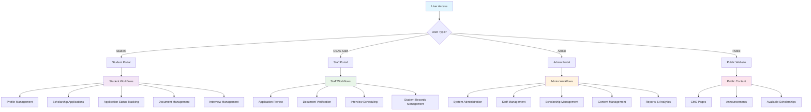

## User Registration & Authentication Flow

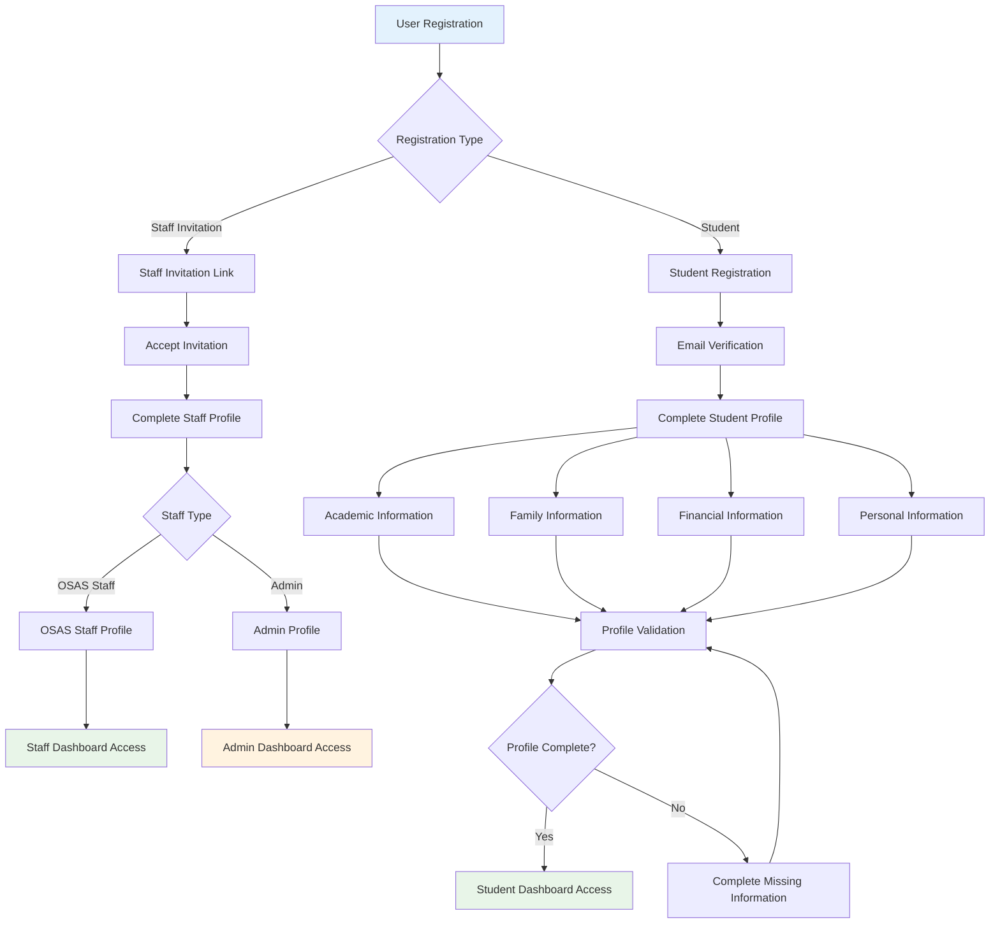

## Scholarship Application Workflow

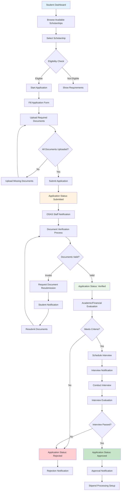

## Document Management Flow

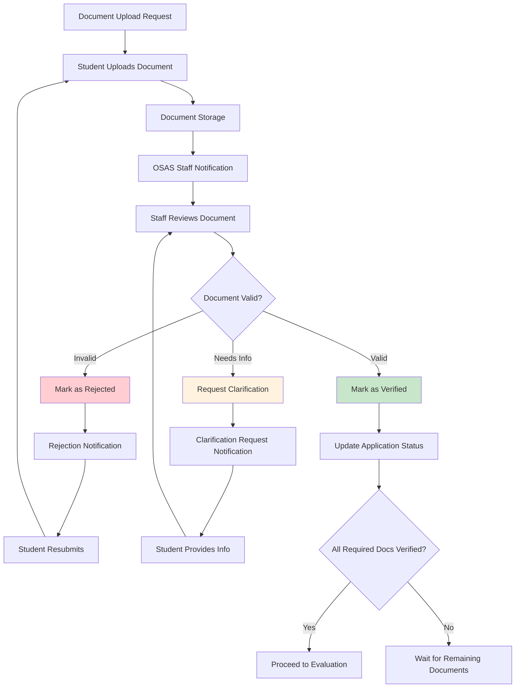

## Interview Management Flow

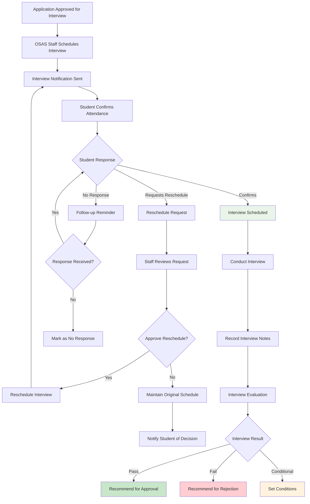

## Stipend Management Flow

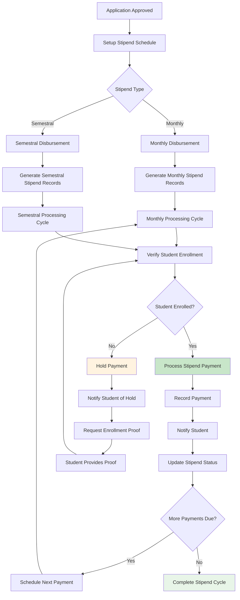

## Administrative Workflows

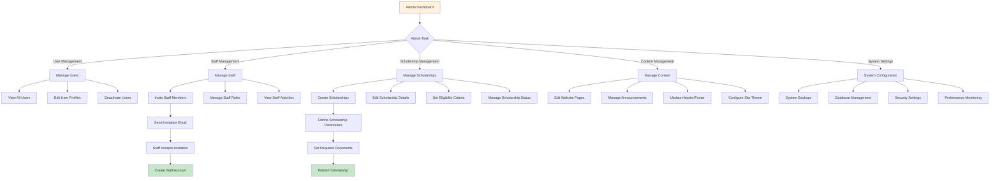

## Notification System Flow

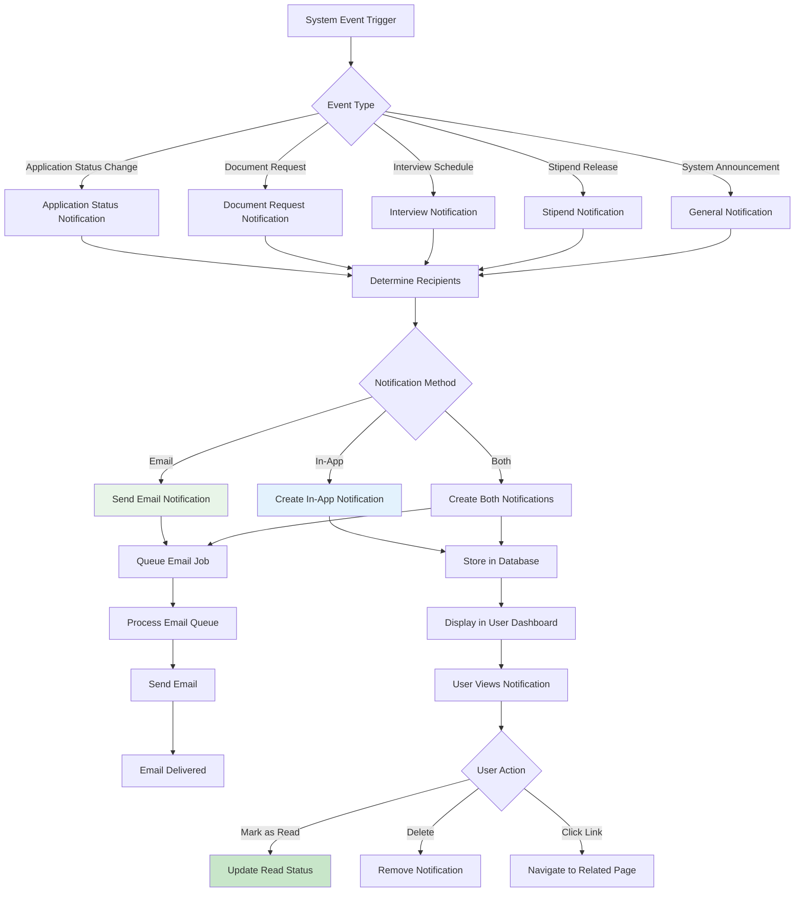

## Public Website Flow

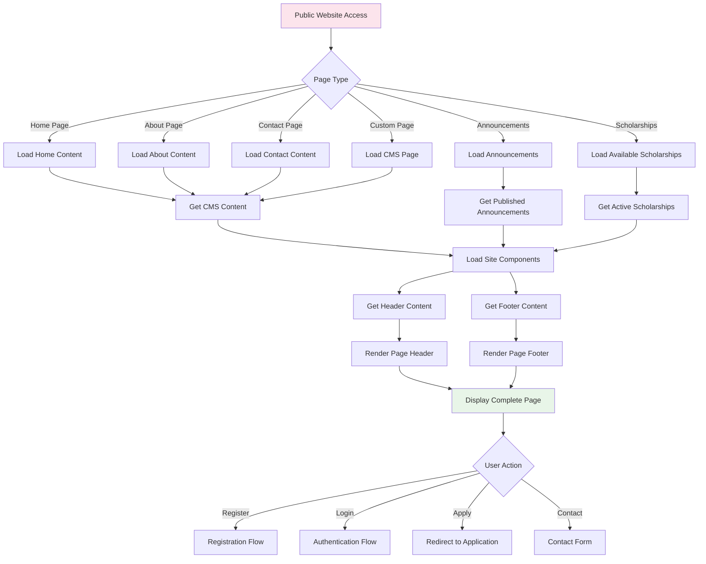

## Data Verification Flow

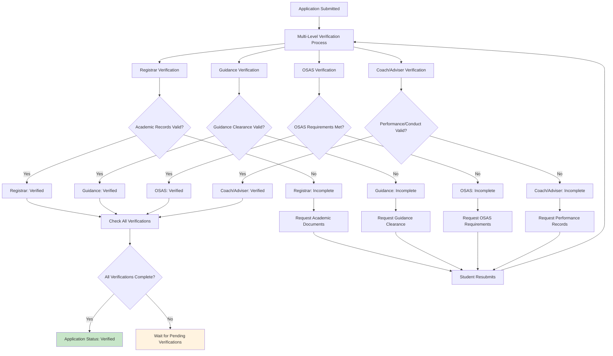

## System Integration Overview

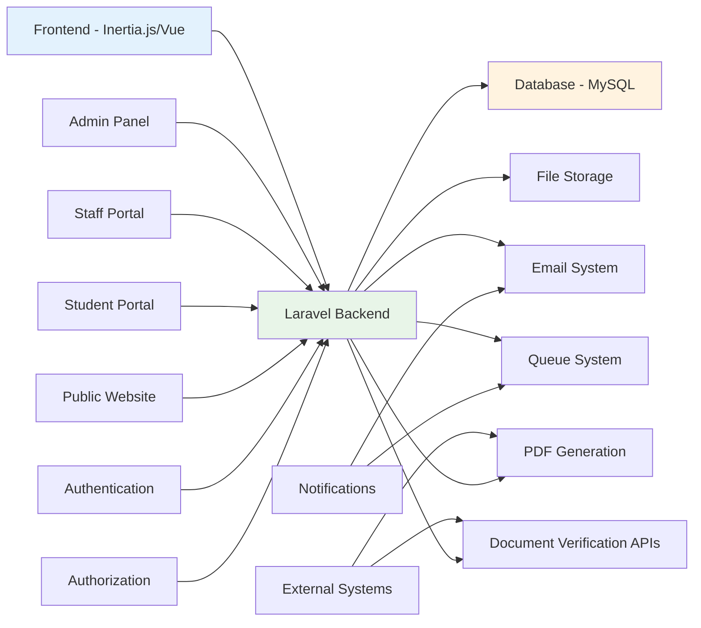

## Key System Features

### Multi-Role Support
- **Students**: Application management, status tracking, document uploads
- **OSAS Staff**: Application review, verification, interview scheduling
- **Administrators**: System management, scholarship creation, user management

### Scholarship Types Supported
- Academic Full Scholarship
- Academic Partial Scholarship  
- Student Assistantship
- Performing Arts Full/Partial
- Economic Assistance
- Custom Scholarship Types

### Document Management
- Secure file uploads and storage
- Multi-level verification process
- Document status tracking
- Automated notifications

### Workflow Management
- Status-based application tracking
- Automated workflow transitions
- Multi-step verification process
- Interview scheduling and management

### Content Management System
- Dynamic page content
- Announcement management
- Site component configuration
- Theme customization

### Financial Management
- Stipend calculation and scheduling
- Payment tracking and reporting
- Multi-semester support
- Renewal management
