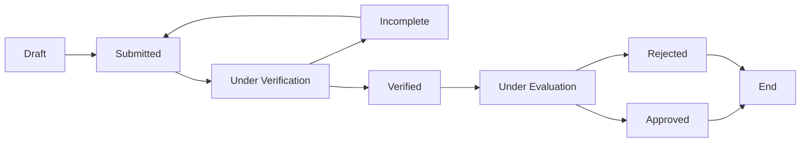

# OSAS Connect - Scholarship Management System

A comprehensive digital platform for managing scholarships at Mindanao State University (MinSU), serving the Office of Student Affairs and Services (OSAS).

## 🚀 Overview

**OSAS Connect** transforms the traditional scholarship process into a modern, efficient digital experience. The system handles everything from initial applications to final stipend disbursements, providing dedicated interfaces for students, OSAS staff, and administrators.

## 📋 Features

### 🎓 Scholarship Programs

The system supports four main scholarship types based on MinSU's institutional policies:

#### 1. Academic Scholarships
- **Full Academic Scholarship**: ₱500/month
  - GWA: 1.000-1.450 (President's Lister)
  - No grade below 2.25
- **Partial Academic Scholarship**: ₱300/month
  - GWA: 1.460-1.750 (Dean's Lister)
  - No grade below 2.50

#### 2. Student Assistantship Program
- Work-study program for deserving students
- Maximum 21 units academic load
- Must demonstrate work capacity

#### 3. Performing Arts Scholarships
- **Full Scholarship**: ₱500/month (1+ year membership)
- **Partial Scholarship**: ₱300/month (1+ semester membership)
- For active members of performing arts groups

#### 4. Economic Assistance Program
- **Amount**: ₱400/month
- GWA requirement: ≤ 2.25
- Valid MSWDO indigency certificate required

### 🔄 Application Workflow

## 👥 User Access & Capabilities

### For Students
- **Discover Scholarships**: Browse all available scholarship opportunities with detailed requirements
- **Apply Online**: Submit applications digitally with document uploads
- **Track Progress**: Monitor application status from submission to approval
- **Document Management**: Upload and update required documents when needed
- **Stipend Tracking**: View disbursement history and payment schedules

### For OSAS Staff
- **Application Review**: Verify submitted applications and documents
- **Interview Management**: Schedule and conduct student interviews
- **Decision Making**: Approve or reject applications with detailed notes
- **Stipend Administration**: Record and track monthly stipend disbursements
- **Reporting**: Generate comprehensive reports on scholarship programs
- **Calendar Management**: Track application deadlines and important dates

### For Administrators
- **System Oversight**: Monitor overall system performance and usage
- **User Management**: Create and manage staff and student accounts
- **Program Configuration**: Set up and modify scholarship programs

## 📋 Application Requirements

### General Eligibility
- Bona fide MinSU student
- Regular academic load (minimum 18 units)
- Good moral character certification
- No existing scholarships from other sources
- Passing grades in all enrolled subjects

### Required Documents
- Certificate of Registration
- Grades/Transcript of Records
- Certificate of Good Moral Character
- Indigency Certificate (for Economic Assistance)
- Organization Membership Certificate (for Performing Arts)

### Document Specifications
- Maximum file size: 5MB per document
- Supported formats: PDF, DOC, DOCX, JPG, PNG
- All documents must be clear and legible

## 📊 Key Benefits

### For Students
- **Streamlined Process**: No more paper forms or long office queues
- **Real-time Updates**: Know your application status instantly
- **Document Security**: Safe storage of important documents
- **Easy Access**: Apply and check status from anywhere, anytime

### For OSAS Staff
- **Efficient Workflow**: Automated processes reduce manual work
- **Better Organization**: Centralized management of all applications
- **Quick Decisions**: Access to all information in one place
- **Comprehensive Tracking**: Monitor all scholarship activities

### For the Institution
- **Transparency**: Clear audit trail of all decisions
- **Data Insights**: Analytics on scholarship distribution and impact
- **Cost Effective**: Reduced paper usage and administrative overhead
- **Compliance**: Ensures adherence to institutional policies

## 🔔 Communication Features

### Automated Notifications
- Application status updates sent to students
- Interview scheduling with automatic reminders
- Document verification results
- Stipend release announcements
- Important deadline reminders

### Multiple Channels
- Email notifications for important updates
- In-app notifications for real-time alerts
- Dashboard announcements for system-wide messages

## 📞 Support

For assistance or inquiries about the OSAS Connect system:
- **Email**: osas@minsu.edu.ph
- **Office**: Office of Student Affairs and Services, MinSU
- **Visit**: OSAS Office during regular business hours

---

**OSAS Connect** - Empowering student success through efficient scholarship management.
