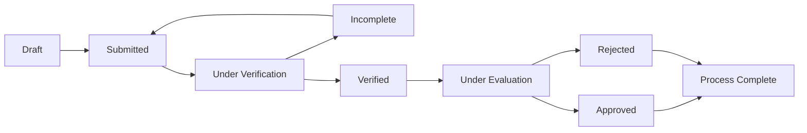

# OSAS Connect - Scholarship Management System

A comprehensive web-based scholarship management system built for Mindanao State University (MinSU), serving the Office of Student Affairs and Services (OSAS). Built with Laravel 12.x and React using Inertia.js.

## Technology Stack

- **Backend**: Laravel 12.x (PHP 8.2+)
- **Frontend**: React 18 with TypeScript
- **UI Framework**: Inertia.js for SPA experience
- **Styling**: Tailwind CSS with Radix UI components
- **Database**: MySQL/PostgreSQL
- **File Storage**: Laravel Storage with AWS S3 support
- **PDF Generation**: DomPDF for reports
- **Testing**: PHPUnit/Pest
- **Development**: Vite for asset bundling

## System Overview

**OSAS Connect** digitizes the entire scholarship lifecycle from application to disbursement. The system features role-based access control with dedicated interfaces for students, OSAS staff, and administrators, handling document management, application workflows, interview scheduling, and stipend tracking.

## Core Features

### Scholarship Program Management

The system supports MinSU's four main scholarship categories with automated eligibility checking:

**Academic Scholarships**
- Full Academic Scholarship: ₱500/month (GWA: 1.000-1.450, President's Lister)
- Partial Academic Scholarship: ₱300/month (GWA: 1.460-1.750, Dean's Lister)

**Student Assistantship Program**
- Work-study program with academic load restrictions (max 21 units)
- Capacity demonstration requirements

**Performing Arts Scholarships**
- Full Scholarship: ₱500/month (1+ year membership)
- Partial Scholarship: ₱300/month (1+ semester membership)

**Economic Assistance Program**
- Amount: ₱400/month
- GWA requirement: ≤ 2.25
- MSWDO indigency certificate validation

### Application Workflow System

Automated status tracking through the complete application lifecycle:



### Technical Features

**Document Management**
- Secure file upload with validation (PDF, DOC, DOCX, JPG, PNG)
- Document verification workflow for OSAS staff
- Version control and audit trails
- Integration with AWS S3 for scalable storage

**User Management & Authentication**
- Role-based access control (Student, OSAS Staff, Administrator)
- Profile management with comprehensive student data
- Staff invitation system with email verification
- Session management and security features

**Notification System**
- Email notifications for status changes
- In-app notification center
- Automated reminders for deadlines and interviews
- Event-driven notification triggers

**Reporting & Analytics**
- PDF generation for official documents
- Export functionality (CSV/Excel)
- Dashboard analytics for all user roles
- Comprehensive audit trails

## User Roles & Capabilities

### Students
- **Dashboard**: Personal scholarship overview with application tracking
- **Browse Scholarships**: Search and filter available opportunities
- **Apply Online**: Multi-step application process with document uploads
- **Track Applications**: Real-time status updates and progress indicators
- **Document Management**: Upload, update, and manage required documents
- **Interview Scheduling**: View and request reschedule for interviews
- **Stipend Tracking**: View payment history and schedules

### OSAS Staff
- **Application Management**: Review, verify, and evaluate applications
- **Document Verification**: Approve or reject submitted documents
- **Interview Coordination**: Schedule and manage student interviews
- **Decision Processing**: Approve or reject applications with detailed notes
- **Stipend Administration**: Record and track monthly payments
- **Student Management**: View and manage student profiles
- **Reporting**: Generate comprehensive program reports
- **Export Data**: Download application data in various formats

### Administrators
- **System Oversight**: Monitor overall platform performance
- **User Management**: Create and manage staff and student accounts
- **Staff Invitations**: Send and manage invitation system for new staff
- **Scholarship Configuration**: Set up and modify scholarship programs
- **CMS Management**: Update website content and announcements
- **Analytics Dashboard**: View system-wide statistics and trends
- **Page Management**: Create and edit dynamic website pages

## System Requirements

### Server Requirements
- PHP 8.2 or higher
- MySQL 8.0+ or PostgreSQL 13+
- Node.js 18+ and npm
- Composer 2.0+
- Web server (Apache/Nginx)

### Development Environment
- Laravel 12.x framework
- React 18 with TypeScript
- Vite for development and build processes
- Tailwind CSS for styling
- Inertia.js for SPA functionality

## Installation & Setup

### 1. Clone Repository
```bash
git clone <repository-url>
cd osas-connect
```

### 2. Install Dependencies
```bash
# Install PHP dependencies
composer install

# Install Node.js dependencies
npm install
```

### 3. Environment Configuration
```bash
# Copy environment file
cp .env.example .env

# Generate application key
php artisan key:generate

# Configure database settings in .env
DB_CONNECTION=mysql
DB_HOST=127.0.0.1
DB_PORT=3306
DB_DATABASE=osas_connect
DB_USERNAME=your_username
DB_PASSWORD=your_password
```

### 4. Database Setup
```bash
# Run migrations
php artisan migrate

# Seed database with sample data
php artisan db:seed
```

### 5. Storage Configuration
```bash
# Create storage link
php artisan storage:link

# Set proper permissions
chmod -R 755 storage bootstrap/cache
```

### 6. Development Server
```bash
# Start Laravel development server
php artisan serve

# In another terminal, start Vite development server
npm run dev
```

## Testing

The application includes comprehensive test coverage using PHPUnit and Pest:

```bash
# Run all tests
php artisan test

# Run specific test file
php artisan test tests/Feature/StudentControllerTest.php

# Run tests with coverage
php artisan test --coverage
```

## Database Structure

### Core Models
- **User**: Base authentication with role management
- **StudentProfile**: Comprehensive student information
- **OsasStaffProfile**: Staff-specific data
- **AdminProfile**: Administrator details
- **Scholarship**: Scholarship program definitions
- **ScholarshipApplication**: Application data and status tracking
- **Document**: File management with verification states
- **Interview**: Interview scheduling and management
- **ApplicationComment**: Staff comments and communication
- **ScholarshipStipend**: Payment tracking
- **Page**: CMS content management
- **SiteComponent**: Dynamic site components

### Key Relationships
- Users have role-specific profiles (Student/Staff/Admin)
- Applications belong to users and scholarships
- Documents are attached to applications
- Interviews are scheduled for applications
- Comments track application communication history

## API Routes

### Authentication Routes
- `POST /login` - User authentication
- `POST /register` - Student registration
- `POST /logout` - User logout
- `GET /forgot-password` - Password reset

### Student Routes
- `GET /student/dashboard` - Student dashboard
- `GET /student/scholarships` - Browse scholarships
- `POST /student/scholarships/{id}/apply` - Submit application
- `GET /student/applications` - View applications
- `POST /student/documents` - Upload documents

### OSAS Staff Routes
- `GET /osas-staff/applications` - Review applications
- `PATCH /osas-staff/applications/{id}/status` - Update status
- `POST /osas-staff/interviews` - Schedule interviews
- `POST /osas-staff/stipends` - Record stipends

### Admin Routes
- `GET /admin/dashboard` - System overview
- `GET /admin/users` - User management
- `POST /admin/scholarships` - Create scholarships
- `GET /admin/reports` - System reports

## Development Workflow

### Code Style & Linting
```bash
# Format code
npm run format

# Check formatting
npm run format:check

# Run ESLint
npm run lint

# Type checking
npm run types
```

### Building for Production
```bash
# Build assets
npm run build

# Build with SSR (if needed)
npm run build:ssr
```

### Database Management
```bash
# Create new migration
php artisan make:migration create_table_name

# Create model with migration
php artisan make:model ModelName -m

# Rollback migrations
php artisan migrate:rollback
```

## Deployment

### Environment Configuration
- Set `APP_ENV=production`
- Configure database credentials
- Set up mail server settings
- Configure AWS S3 (if using cloud storage)
- Set proper file permissions

### Optimization
```bash
# Cache configuration
php artisan config:cache

# Cache routes
php artisan route:cache

# Cache views
php artisan view:cache

# Optimize autoloader
composer install --optimize-autoloader --no-dev
```

## Security Features

- **Role-based Access Control**: Middleware-enforced permissions
- **File Upload Validation**: Type and size restrictions
- **CSRF Protection**: Laravel's built-in CSRF tokens
- **SQL Injection Prevention**: Eloquent ORM and prepared statements
- **XSS Protection**: HTML sanitization and escaping
- **Authentication**: Laravel's authentication system
- **Authorization Policies**: Model-based authorization

## Contributing

### Development Guidelines
1. Follow PSR-12 coding standards for PHP
2. Use TypeScript for all React components
3. Write tests for new features
4. Update documentation for API changes
5. Follow conventional commit messages

### Pull Request Process
1. Create feature branch from `main`
2. Make changes with appropriate tests
3. Run test suite and ensure passing
4. Update documentation if needed
5. Submit pull request with detailed description

## Support & Contact

For technical support or system inquiries:

- **Technical Issues**: Create an issue in the repository
- **OSAS Office**: Office of Student Affairs and Services, MinSU
- **Email**: osas@minsu.edu.ph
- **Documentation**: See [docs/README.md](docs/README.md) for detailed guides

## License

This project is proprietary software developed for Mindanao State University. All rights reserved.

---

**OSAS Connect** - Modern scholarship management for academic excellence.
