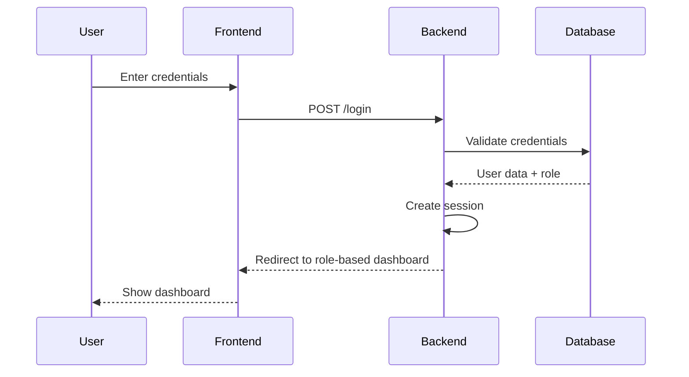
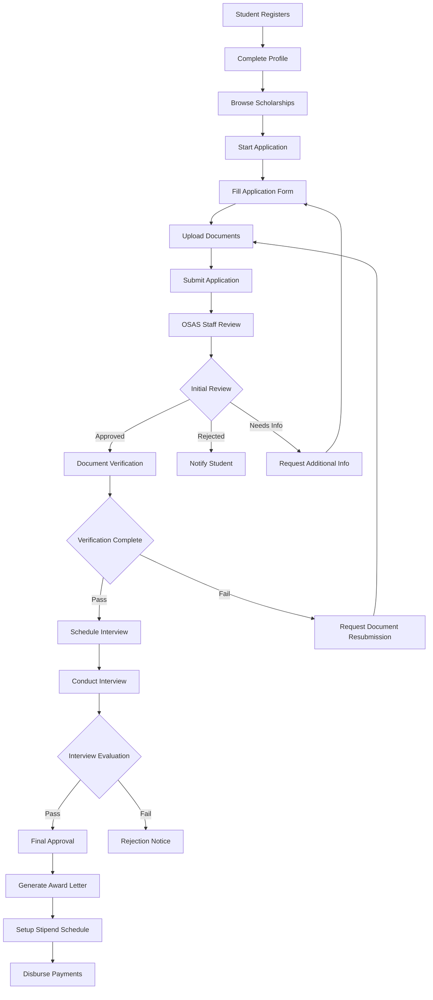
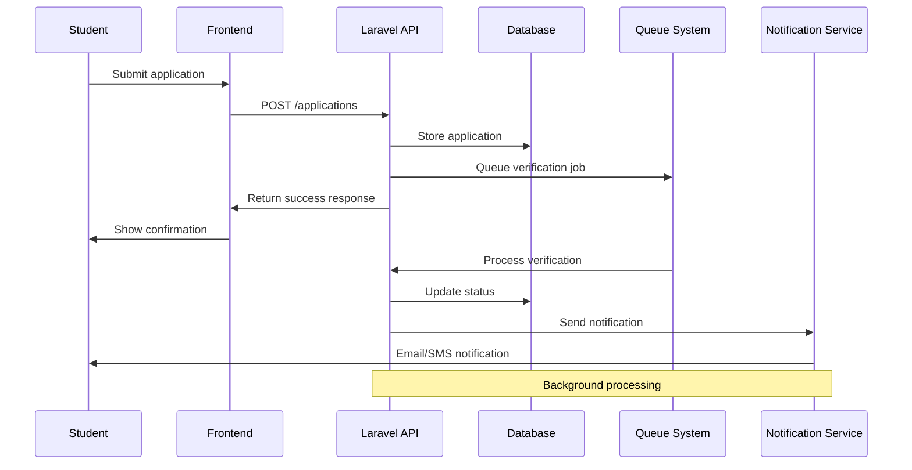

# OSAS Connect - System Architecture Documentation

## Table of Contents
1. [System Overview](#system-overview)
2. [Technology Stack](#technology-stack)
3. [Application Architecture](#application-architecture)
4. [Database Architecture](#database-architecture)
5. [Frontend Architecture](#frontend-architecture)
6. [Backend Architecture](#backend-architecture)
7. [Authentication & Authorization](#authentication--authorization)
8. [API Design & Routing](#api-design--routing)
9. [Data Flow](#data-flow)
10. [Security Architecture](#security-architecture)
11. [File Storage & Media](#file-storage--media)
12. [Deployment Architecture](#deployment-architecture)
13. [Development Workflow](#development-workflow)

## System Overview

OSAS Connect is a comprehensive scholarship management system designed for the Office of Student Affairs and Services (OSAS). The application facilitates the entire scholarship lifecycle from application submission to stipend distribution, serving three primary user roles: Students, OSAS Staff, and System Administrators.

### Key Features
- **Multi-role Authentication System** (Student, OSAS Staff, Admin)
- **Scholarship Application Management** with four scholarship types
- **Document Upload and Verification** system
- **Interview Scheduling and Management**
- **Stipend Distribution Tracking**
- **Real-time Notifications and Communication**
- **Comprehensive Reporting and Analytics**

### Scholarship Types Supported
1. **Academic Scholarships** (Full/Partial)
2. **Student Assistantship Programs**
3. **Performing Arts Scholarships**
4. **Economic Assistance Programs**

## Technology Stack

### Backend Technologies
- **Framework**: Laravel 12.x (PHP 8.2+)
- **Database**: MySQL (Primary), SQLite (Testing)
- **ORM**: Eloquent
- **Authentication**: Laravel Breeze with role-based access control
- **Queue System**: Database-driven queues with Redis support
- **Cache**: Database/Redis caching
- **PDF Generation**: DomPDF, PDFtk
- **Email**: SMTP with Gmail integration

### Frontend Technologies
- **Framework**: React 19.x with TypeScript
- **Build Tool**: Vite 6.x
- **UI Framework**: Tailwind CSS 4.x
- **Component Library**: Radix UI with shadcn/ui
- **State Management**: Inertia.js (Server-side rendering)
- **Icons**: Lucide React
- **Forms**: React Hook Form integration
- **Styling**: Tailwind CSS with custom design system

### Development Tools
- **Package Manager**: npm
- **Code Quality**: ESLint, Prettier, TypeScript
- **Testing**: PHPUnit (Backend), Pest (PHP)
- **Development Server**: Vite dev server with HMR
- **Process Management**: Concurrently for parallel processes

## Application Architecture

### Architectural Pattern
The application follows a **Monolithic MVC Architecture** with **Server-Side Rendering (SSR)** using Inertia.js, providing the benefits of a SPA with the SEO and performance advantages of SSR.

```
┌─────────────────────────────────────────────────────────────┐
│                        OSAS Connect                        │
├─────────────────────────────────────────────────────────────┤
│  Frontend Layer (React + TypeScript + Inertia.js)          │
│  ┌─────────────────┐ ┌─────────────────┐ ┌──────────────┐  │
│  │     Pages       │ │   Components    │ │   Layouts    │  │
│  │  - Dashboard    │ │  - UI Library   │ │  - App       │  │
│  │  - Auth         │ │  - Forms        │ │  - Auth      │  │
│  │  - Settings     │ │  - Tables       │ │  - Settings  │  │
│  └─────────────────┘ └─────────────────┘ └──────────────┘  │
├─────────────────────────────────────────────────────────────┤
│  Backend Layer (Laravel + PHP)                             │
│  ┌─────────────────┐ ┌─────────────────┐ ┌──────────────┐  │
│  │   Controllers   │ │    Services     │ │  Middleware  │  │
│  │  - AdminCtrl    │ │  - ScholarApp   │ │  - Auth      │  │
│  │  - StaffCtrl    │ │  - NotifSvc     │ │  - Role      │  │
│  │  - StudentCtrl  │ │  - PdfGenSvc    │ │  - CORS      │  │
│  └─────────────────┘ └─────────────────┘ └──────────────┘  │
├─────────────────────────────────────────────────────────────┤
│  Data Layer (MySQL Database)                               │
│  ┌─────────────────┐ ┌─────────────────┐ ┌──────────────┐  │
│  │     Models      │ │   Migrations    │ │   Seeders    │  │
│  │  - User         │ │  - CreateUsers  │ │  - UserSeed  │  │
│  │  - Scholarship  │ │  - CreateSchol  │ │  - AdminSeed │  │
│  │  - Application  │ │  - CreateAppl   │ │  - DataSeed  │  │
│  └─────────────────┘ └─────────────────┘ └──────────────┘  │
└─────────────────────────────────────────────────────────────┘
```

### Layer Responsibilities

**Frontend Layer**:
- User interface rendering and interaction
- Form validation and submission
- Real-time updates via Inertia.js
- Responsive design across devices

**Backend Layer**:
- Business logic implementation
- API endpoint management
- Authentication and authorization
- Data validation and processing

**Data Layer**:
- Data persistence and retrieval
- Relationship management
- Data integrity enforcement
- Performance optimization

## Database Architecture

### Entity Relationship Overview

```
Users (Central Entity)
├── Student Profiles (1:1)
├── OSAS Staff Profiles (1:1)
├── Admin Profiles (1:1)
└── Scholarship Applications (1:n)

Scholarships
├── Applications (1:n)
├── Criteria (1:n)
└── Requirements (1:n)

Applications
├── Verifications (1:n)
├── Interviews (1:1)
├── Stipends (1:n)
├── Notifications (1:n)
└── Documents (1:n)
```

### Core Database Tables

#### User Management Tables
```sql
-- Primary user authentication table
users
├── id (Primary Key)
├── email (Unique)
├── password (Hashed)
├── role (enum: admin, osas_staff, student)
├── email_verified_at
├── first_name, middle_name, last_name
├── contact_number, birth_date, gender
├── is_active (Boolean)
└── timestamps

-- Role-specific profile tables
student_profiles
├── id (Primary Key)
├── user_id (Foreign Key → users.id)
├── student_id (Unique)
├── course, year_level, gpa
├── academic_standing
├── financial_information (JSON)
├── family_composition (JSON)
├── address_information (JSON)
└── timestamps

osas_staff_profiles
├── id (Primary Key)
├── user_id (Foreign Key → users.id)
├── staff_id (Unique)
└── timestamps

admin_profiles
├── id (Primary Key)
├── user_id (Foreign Key → users.id)
├── admin_id (Unique)
└── timestamps
```

#### Scholarship Management Tables
```sql
scholarships
├── id (Primary Key)
├── name, description
├── type (enum: academic, assistantship, performing_arts, economic)
├── subtype (full, partial, etc.)
├── amount, max_recipients
├── eligibility_criteria (JSON)
├── required_documents (JSON)
├── application_deadline
├── is_active
└── timestamps

scholarship_applications
├── id (Primary Key)
├── user_id (Foreign Key → users.id)
├── scholarship_id (Foreign Key → scholarships.id)
├── status (enum: draft, submitted, under_review, approved, rejected)
├── submitted_at
├── application_data (JSON)
├── supporting_documents (JSON)
└── timestamps

scholarship_verifications
├── id (Primary Key)
├── application_id (Foreign Key → scholarship_applications.id)
├── verifier_id (Foreign Key → users.id)
├── verification_type
├── status, notes
├── verified_at
└── timestamps

interviews
├── id (Primary Key)
├── application_id (Foreign Key → scholarship_applications.id)
├── interviewer_id (Foreign Key → users.id)
├── scheduled_at, location
├── status, notes, score
└── timestamps

scholarship_stipends
├── id (Primary Key)
├── application_id (Foreign Key → scholarship_applications.id)
├── amount, disbursement_date
├── status, payment_method
├── academic_period
└── timestamps
```

#### Communication & Notification Tables
```sql
scholarship_notifications
├── id (Primary Key)
├── user_id (Foreign Key → users.id)
├── application_id (Foreign Key → scholarship_applications.id)
├── type, title, message
├── is_read, read_at
└── timestamps

documents
├── id (Primary Key)
├── user_id (Foreign Key → users.id)
├── application_id (Foreign Key → scholarship_applications.id)
├── file_name, file_path, file_type
├── document_type, verification_status
└── timestamps
```

### Database Indexes and Performance

```sql
-- Performance optimization indexes
CREATE INDEX idx_users_role ON users(role);
CREATE INDEX idx_users_email ON users(email);
CREATE INDEX idx_applications_status ON scholarship_applications(status);
CREATE INDEX idx_applications_user_scholarship ON scholarship_applications(user_id, scholarship_id);
CREATE INDEX idx_notifications_user_unread ON scholarship_notifications(user_id, is_read);
CREATE INDEX idx_stipends_application_status ON scholarship_stipends(application_id, status);
```

## Frontend Architecture

### Component Structure

```
src/
├── components/
│   ├── ui/                    # Base UI components (shadcn/ui)
│   │   ├── button.tsx
│   │   ├── card.tsx
│   │   ├── form.tsx
│   │   ├── table.tsx
│   │   └── sidebar.tsx
│   ├── app-components/        # Application-specific components
│   │   ├── app-header.tsx
│   │   ├── app-sidebar.tsx
│   │   ├── app-content.tsx
│   │   └── nav-main.tsx
│   ├── forms/                 # Form components
│   │   ├── scholarship-application-form.tsx
│   │   ├── profile-form.tsx
│   │   └── document-upload.tsx
│   └── tables/                # Data table components
│       ├── applications-table.tsx
│       ├── users-table.tsx
│       └── scholarships-table.tsx
├── pages/                     # Inertia.js pages
│   ├── auth/
│   │   ├── login.tsx
│   │   └── register.tsx
│   ├── admin/
│   │   ├── dashboard.tsx
│   │   ├── manage-students.tsx
│   │   └── manage-staff.tsx
│   ├── osas_staff/
│   │   ├── dashboard.tsx
│   │   ├── applications.tsx
│   │   └── manage-scholarships.tsx
│   └── student/
│       ├── dashboard.tsx
│       ├── applications.tsx
│       ├── interviews/
│       └── view-scholarships.tsx
├── layouts/                   # Layout components
│   ├── app-layout.tsx
│   ├── auth-layout.tsx
│   └── settings/
│       └── layout.tsx
├── hooks/                     # Custom React hooks
│   ├── use-appearance.ts
│   └── use-mobile.ts
├── lib/                       # Utility functions
│   ├── utils.ts
│   └── validation.ts
└── types/                     # TypeScript type definitions
    ├── index.d.ts
    └── models.d.ts
```

### State Management Strategy

The application uses **Inertia.js** for state management, which provides:

1. **Server-Side State**: All persistent data is managed on the server
2. **Client-Side Reactivity**: React handles UI state and interactions
3. **Automatic Synchronization**: Inertia.js keeps client and server in sync
4. **Type Safety**: TypeScript provides compile-time type checking

### Design System

```typescript
// Theme configuration
const theme = {
  colors: {
    primary: {
      50: '#f0fdf4',
      500: '#22c55e',  // Main green
      600: '#16a34a',
      900: '#14532d'
    },
    accent: {
      500: '#febd12'   // Yellow accent
    }
  },
  fontFamily: {
    sans: ['Instrument Sans', 'sans-serif']
  }
}
```

## Backend Architecture

### Controller Structure

```php
app/Http/Controllers/
├── Auth/
│   ├── AuthenticatedSessionController.php
│   ├── RegisteredUserController.php
│   └── PasswordResetLinkController.php
├── AdminController.php           # Admin-specific operations
├── OsasStaffController.php       # Staff management functions
├── StudentController.php         # Student dashboard and profiles
├── ScholarshipController.php     # Scholarship CRUD operations
├── ScholarshipApplicationController.php
├── InterviewController.php       # Interview scheduling
├── StipendController.php         # Payment management
└── NotificationController.php    # Notification system
```

### Service Layer Architecture

```php
app/Services/
├── ScholarshipApplicationService.php
│   ├── createApplication()
│   ├── updateApplicationStatus()
│   ├── calculateEligibility()
│   └── generateApplicationPDF()
├── NotificationService.php
│   ├── sendApplicationUpdate()
│   ├── scheduleInterviewNotification()
│   └── broadcastStatusChange()
├── PdfGenerationService.php
│   ├── generateApplicationForm()
│   ├── generateStipendReceipt()
│   └── generateCertificate()
└── FileUploadService.php
    ├── uploadDocument()
    ├── validateFileType()
    └── organizeStorage()
```

### Policy-Based Authorization

```php
app/Policies/
├── ScholarshipApplicationPolicy.php
│   ├── view()           # Check if user can view application
│   ├── update()         # Check if user can update application
│   ├── delete()         # Check if user can delete application
│   └── verify()         # Check if user can verify application
├── UserPolicy.php
│   ├── viewAny()        # List users
│   ├── create()         # Create new users
│   └── delete()         # Delete users
└── ScholarshipPolicy.php
    ├── view()
    ├── create()
    └── update()
```

### Middleware Stack

```php
app/Http/Middleware/
├── CheckUserRole.php            # Role-based access control
├── HandleInertiaRequests.php    # Inertia.js request handling
├── HandleAppearance.php         # Theme management
└── ValidateScholarshipApplication.php  # Application validation
```

## Authentication & Authorization

### Authentication Flow



### Role-Based Access Control (RBAC)

```php
// User roles enumeration
enum UserRole: string {
    case ADMIN = 'admin';
    case OSAS_STAFF = 'osas_staff';
    case STUDENT = 'student';
}

// Route protection example
Route::middleware(['auth', 'role:admin'])->group(function () {
    Route::get('/admin/dashboard', [AdminController::class, 'dashboard']);
    Route::resource('/admin/users', UserController::class);
});

Route::middleware(['auth', 'role:osas_staff'])->group(function () {
    Route::get('/staff/applications', [ApplicationController::class, 'index']);
    Route::post('/staff/verify', [VerificationController::class, 'store']);
});

Route::middleware(['auth', 'role:student'])->group(function () {
    Route::get('/student/dashboard', [StudentController::class, 'dashboard']);
    Route::resource('/student/applications', StudentApplicationController::class);
});
```

### Permission Matrix

| Feature | Admin | OSAS Staff | Student |
|---------|-------|------------|---------|
| User Management | ✅ Full | ❌ None | ❌ None |
| Scholarship Creation | ✅ Full | ✅ Create/Edit | ❌ View Only |
| Application Review | ✅ Full | ✅ Review/Verify | ❌ Own Only |
| Interview Scheduling | ✅ Full | ✅ Schedule/Conduct | ❌ View Own |
| Stipend Management | ✅ Full | ✅ Process | ❌ View Own |
| Reports & Analytics | ✅ Full | ✅ Limited | ❌ Personal |

## API Design & Routing

### Route Structure

```php
// routes/web.php - Main application routes
Route::get('/', [HomeController::class, 'index'])->name('home');
Route::get('/about', [AboutController::class, 'index'])->name('about');
Route::get('/contact', [ContactController::class, 'index'])->name('contact');

// routes/auth.php - Authentication routes
Route::middleware('guest')->group(function () {
    Route::get('register', [RegisteredUserController::class, 'create'])->name('register');
    Route::post('register', [RegisteredUserController::class, 'store']);
    Route::get('login', [AuthenticatedSessionController::class, 'create'])->name('login');
    Route::post('login', [AuthenticatedSessionController::class, 'store']);
});

// routes/admin.php - Admin-specific routes
Route::middleware(['auth', 'role:admin'])->prefix('admin')->name('admin.')->group(function () {
    Route::get('/dashboard', [AdminController::class, 'dashboard'])->name('dashboard');
    Route::resource('users', UserController::class);
    Route::resource('scholarships', ScholarshipController::class);
    Route::get('reports', [ReportController::class, 'index'])->name('reports');
});

// routes/staff.php - OSAS Staff routes
Route::middleware(['auth', 'role:osas_staff'])->prefix('staff')->name('staff.')->group(function () {
    Route::get('/dashboard', [StaffController::class, 'dashboard'])->name('dashboard');
    Route::resource('applications', ApplicationController::class);
    Route::post('verify/{application}', [VerificationController::class, 'store'])->name('verify');
    Route::resource('interviews', InterviewController::class);
});

// routes/student.php - Student routes
Route::middleware(['auth', 'role:student'])->prefix('student')->name('student.')->group(function () {
    Route::get('/dashboard', [StudentController::class, 'dashboard'])->name('dashboard');
    Route::resource('applications', StudentApplicationController::class);
    Route::get('scholarships', [ScholarshipController::class, 'index'])->name('scholarships.index');
    Route::resource('interviews', StudentInterviewController::class)->only(['index', 'show']);
});
```

### API Response Patterns

```php
// Standardized API responses using Inertia.js
class ApiResponseService {
    public static function success(string $component, array $props = []): Response
    {
        return Inertia::render($component, $props);
    }
    
    public static function error(string $message, int $status = 422): Response
    {
        return redirect()->back()->withErrors(['error' => $message]);
    }
    
    public static function paginated(string $component, $model, array $additional = []): Response
    {
        return Inertia::render($component, array_merge([
            'data' => $model->paginate(15),
            'filters' => request()->only(['search', 'status', 'type'])
        ], $additional));
    }
}
```

## Data Flow

### Scholarship Application Workflow



### Data Synchronization Flow



## Security Architecture

### Security Measures

#### Authentication Security
```php
// Password hashing with bcrypt
'passwords' => [
    'users' => [
        'provider' => 'users',
        'table' => 'password_reset_tokens',
        'expire' => 60,
        'throttle' => 60,
    ],
],

// Session configuration
'lifetime' => env('SESSION_LIFETIME', 120),
'expire_on_close' => false,
'encrypt' => true,
'http_only' => true,
'same_site' => 'lax',
```

#### CSRF Protection
```php
// CSRF middleware applied to all routes
Route::middleware(['web'])->group(function () {
    // All routes include CSRF protection
});
```

#### Input Validation
```php
// Form request validation
class ScholarshipApplicationRequest extends FormRequest
{
    public function rules(): array
    {
        return [
            'scholarship_id' => 'required|exists:scholarships,id',
            'personal_statement' => 'required|string|max:2000',
            'documents.*' => 'required|file|mimes:pdf,jpg,png|max:5120',
            'academic_records' => 'required|file|mimes:pdf|max:10240',
        ];
    }
}
```

#### File Upload Security
```php
class FileUploadService
{
    protected array $allowedMimes = [
        'pdf' => 'application/pdf',
        'jpg' => 'image/jpeg',
        'png' => 'image/png',
        'doc' => 'application/msword',
        'docx' => 'application/vnd.openxmlformats-officedocument.wordprocessingml.document'
    ];
    
    protected int $maxFileSize = 10485760; // 10MB
    
    public function upload(UploadedFile $file, string $path): string
    {
        // Validate file type and size
        $this->validateFile($file);
        
        // Generate secure filename
        $filename = $this->generateSecureFilename($file);
        
        // Store with restricted access
        return $file->storeAs($path, $filename, 'private');
    }
}
```

#### Database Security
```php
// Query parameter binding (automatically handled by Eloquent)
$applications = ScholarshipApplication::where('user_id', $userId)
    ->where('status', $status)
    ->get();

// Mass assignment protection
class ScholarshipApplication extends Model
{
    protected $fillable = [
        'scholarship_id',
        'application_data',
        'status'
    ];
    
    protected $guarded = [
        'id',
        'created_at',
        'updated_at'
    ];
}
```

## File Storage & Media

### Storage Configuration

```php
// config/filesystems.php
'disks' => [
    'local' => [
        'driver' => 'local',
        'root' => storage_path('app'),
        'throw' => false,
    ],
    
    'public' => [
        'driver' => 'local',
        'root' => storage_path('app/public'),
        'url' => env('APP_URL').'/storage',
        'visibility' => 'public',
    ],
    
    'documents' => [
        'driver' => 'local',
        'root' => storage_path('app/documents'),
        'visibility' => 'private',
    ],
      // Cloud storage for production
    's3' => [
        'driver' => 's3',
        'key' => env('AWS_ACCESS_KEY_ID'),
        'secret' => env('AWS_SECRET_ACCESS_KEY'),
        'region' => env('AWS_DEFAULT_REGION'),
        'bucket' => env('AWS_BUCKET'),
    ],
    
    // CloudCube S3 storage for Heroku deployment
    'cloudcube' => [
        'driver' => 's3',
        'key' => env('CLOUDCUBE_ACCESS_KEY_ID'),
        'secret' => env('CLOUDCUBE_SECRET_ACCESS_KEY'),
        'region' => env('AWS_DEFAULT_REGION', 'us-east-1'),
        'bucket' => env('CLOUDCUBE_BUCKET', 'cloud-cube'),
        'root' => env('CLOUDCUBE_CUBE_NAME', 'm2on55doosrx'),
        'url' => env('CLOUDCUBE_BASE_URL', 'https://cloud-cube.s3.amazonaws.com/m2on55doosrx'),
        'visibility' => 'public',
        'throw' => false,
        'report' => false,
    ],
];
```

### File Organization Structure

#### Local Development Structure

```
storage/app/
├── documents/
│   ├── applications/
│   │   ├── {user_id}/
│   │   │   ├── academic_records/
│   │   │   ├── recommendation_letters/
│   │   │   ├── financial_documents/
│   │   │   └── identity_documents/
│   │   └── verified/
│   └── templates/
│       ├── application_forms/
│       ├── certificates/
│       └── reports/
├── exports/
│   ├── applications_export_{date}.xlsx
│   ├── stipend_report_{date}.pdf
│   └── user_report_{date}.csv
└── uploads/
    ├── profile_photos/
    └── temp/
```

#### CloudCube Production Structure

```
m2on55doosrx/                    (cube prefix)
├── public/                      (publicly accessible files)
│   ├── profiles/
│   │   ├── profile_1.jpg
│   │   └── profile_2.png
│   ├── uploads/
│   │   ├── documents/
│   │   └── images/
│   ├── assets/
│   │   ├── templates/
│   │   └── logos/
│   └── exports/
│       ├── reports/
│       └── data/
└── private/                     (secure files with signed URLs)
    ├── applications/
    │   ├── user_123/
    │   │   ├── academic_records/
    │   │   ├── recommendation_letters/
    │   │   ├── financial_documents/
    │   │   └── identity_documents/
    │   └── verified/
    ├── reports/
    │   ├── admin/
    │   └── financial/
    └── backups/
        ├── database/
        └── files/
```

### CloudCube S3 Configuration

CloudCube is a Heroku add-on that provides S3-compatible storage. Each CloudCube instance gets a dedicated "cube" (prefix) within a shared S3 bucket.

#### URL Pattern
```
https://BUCKETNAME.s3.amazonaws.com/CUBENAME/...
```

For our application:
- **Bucket**: `cloud-cube`
- **Cube Name**: `m2on55doosrx`
- **Base URL**: `https://cloud-cube.s3.amazonaws.com/m2on55doosrx`

#### Environment Variables

```bash
# CloudCube Configuration (Heroku Config Vars)
CLOUDCUBE_ACCESS_KEY_ID=your_access_key
CLOUDCUBE_SECRET_ACCESS_KEY=your_secret_key
CLOUDCUBE_BUCKET=cloud-cube
CLOUDCUBE_CUBE_NAME=m2on55doosrx
CLOUDCUBE_BASE_URL=https://cloud-cube.s3.amazonaws.com/m2on55doosrx
```

#### Usage Examples

```php
use App\Services\CloudCubeService;

// Upload public file (accessible via direct URL)
$path = CloudCubeService::uploadPublic($file, 'document.pdf', 'applications');
$publicUrl = CloudCubeService::getPublicUrl($path);

// Upload private file (requires signed URL for access)
$path = CloudCubeService::uploadPrivate($file, 'sensitive.pdf', 'documents');
$signedUrl = CloudCubeService::getSignedUrl($path, 60); // 60 minutes

// Delete file
CloudCubeService::delete($path);
```

## Deployment Architecture

### Local Development Environment

```bash
# Development setup
composer install
npm install
cp .env.example .env
php artisan key:generate
php artisan migrate --seed

# Development servers
npm run dev                    # Frontend development server
php artisan serve             # Backend development server
php artisan queue:work        # Queue processing
```

### Production Deployment (Server Requirements)

#### System Requirements
- **PHP**: 8.2+ with extensions (BCMath, Ctype, Fileinfo, JSON, Mbstring, PDO, Tokenizer, XML)
- **Database**: MySQL 8.0+ or MariaDB 10.3+
- **Web Server**: Apache 2.4+ or Nginx 1.18+
- **Node.js**: 18+ for build process
- **Memory**: 512MB minimum, 1GB recommended
- **Storage**: 5GB minimum for documents and logs

#### Production Configuration

```bash
# Environment setup
APP_ENV=production
APP_DEBUG=false
APP_URL=https://osas-connect.university.edu

# Database
DB_CONNECTION=mysql
DB_HOST=127.0.0.1
DB_PORT=3306
DB_DATABASE=osas_connect
DB_USERNAME=osas_user
DB_PASSWORD=secure_password

# Cache and Sessions
CACHE_DRIVER=redis
SESSION_DRIVER=redis
QUEUE_CONNECTION=redis

# File Storage
FILESYSTEM_DISK=s3
AWS_BUCKET=osas-connect-documents

# Mail Configuration
MAIL_MAILER=smtp
MAIL_HOST=smtp.university.edu
MAIL_PORT=587
MAIL_USERNAME=noreply@university.edu
MAIL_PASSWORD=mail_password
MAIL_ENCRYPTION=tls
```

#### Deployment Script

```bash
#!/bin/bash
# deployment.sh

echo "Starting OSAS Connect deployment..."

# Pull latest code
git pull origin main

# Install dependencies
composer install --no-dev --optimize-autoloader
npm ci

# Build frontend assets
npm run build

# Run database migrations
php artisan migrate --force

# Clear and cache configuration
php artisan config:cache
php artisan route:cache
php artisan view:cache

# Restart queue workers
php artisan queue:restart

# Set permissions
chmod -R 755 storage bootstrap/cache
chown -R www-data:www-data storage bootstrap/cache

echo "Deployment completed successfully!"
```

### Docker Configuration (Optional)

```dockerfile
# Dockerfile
FROM php:8.2-fpm

# Install system dependencies
RUN apt-get update && apt-get install -y \
    git curl libpng-dev libonig-dev libxml2-dev zip unzip \
    nodejs npm

# Install PHP extensions
RUN docker-php-ext-install pdo_mysql mbstring exif pcntl bcmath gd

# Install Composer
COPY --from=composer:latest /usr/bin/composer /usr/bin/composer

# Set working directory
WORKDIR /var/www/html

# Copy application
COPY . .

# Install dependencies
RUN composer install --no-dev --optimize-autoloader
RUN npm ci && npm run build

# Set permissions
RUN chown -R www-data:www-data storage bootstrap/cache

EXPOSE 9000
CMD ["php-fpm"]
```

### Database Backup Strategy

```bash
#!/bin/bash
# backup.sh

DATE=$(date +%Y%m%d_%H%M%S)
BACKUP_DIR="/backups/osas-connect"
DB_NAME="osas_connect"

# Create backup directory
mkdir -p $BACKUP_DIR

# Database backup
mysqldump -u $DB_USER -p$DB_PASSWORD $DB_NAME > $BACKUP_DIR/db_backup_$DATE.sql

# Compress documents
tar -czf $BACKUP_DIR/documents_backup_$DATE.tar.gz storage/app/documents/

# Clean old backups (keep 30 days)
find $BACKUP_DIR -name "*.sql" -mtime +30 -delete
find $BACKUP_DIR -name "*.tar.gz" -mtime +30 -delete

echo "Backup completed: $DATE"
```

## Development Workflow

### Git Workflow

```bash
# Feature development workflow
git checkout main
git pull origin main
git checkout -b feature/scholarship-application-enhancement

# Make changes and commit
git add .
git commit -m "feat: add document verification workflow"

# Push and create pull request
git push origin feature/scholarship-application-enhancement
```

### Code Quality Standards

```javascript
// package.json scripts
{
  "scripts": {
    "dev": "vite",
    "build": "vite build",
    "build:ssr": "vite build && vite build --ssr",
    "lint": "eslint . --fix",
    "format": "prettier --write resources/",
    "types": "tsc --noEmit"
  }
}
```

```php
// composer.json scripts
{
  "scripts": {
    "post-autoload-dump": [
      "Illuminate\\Foundation\\ComposerScripts::postAutoloadDump",
      "@php artisan package:discover --ansi"
    ],
    "test": [
      "@php artisan test"
    ],
    "format": [
      "vendor/bin/pint"
    ]
  }
}
```

### Testing Strategy

```php
// tests/Feature/ScholarshipApplicationTest.php
class ScholarshipApplicationTest extends TestCase
{
    public function test_student_can_create_application(): void
    {
        $student = User::factory()->student()->create();
        $scholarship = Scholarship::factory()->create();
        
        $response = $this->actingAs($student)
            ->post('/student/applications', [
                'scholarship_id' => $scholarship->id,
                'application_data' => [
                    'personal_statement' => 'Test statement'
                ]
            ]);
            
        $response->assertRedirect();
        $this->assertDatabaseHas('scholarship_applications', [
            'user_id' => $student->id,
            'scholarship_id' => $scholarship->id
        ]);
    }
}
```

This comprehensive system architecture documentation provides a complete overview of the OSAS Connect application's structure, technologies, and implementation details. The documentation serves as a reference for developers, system administrators, and stakeholders involved in the project.
