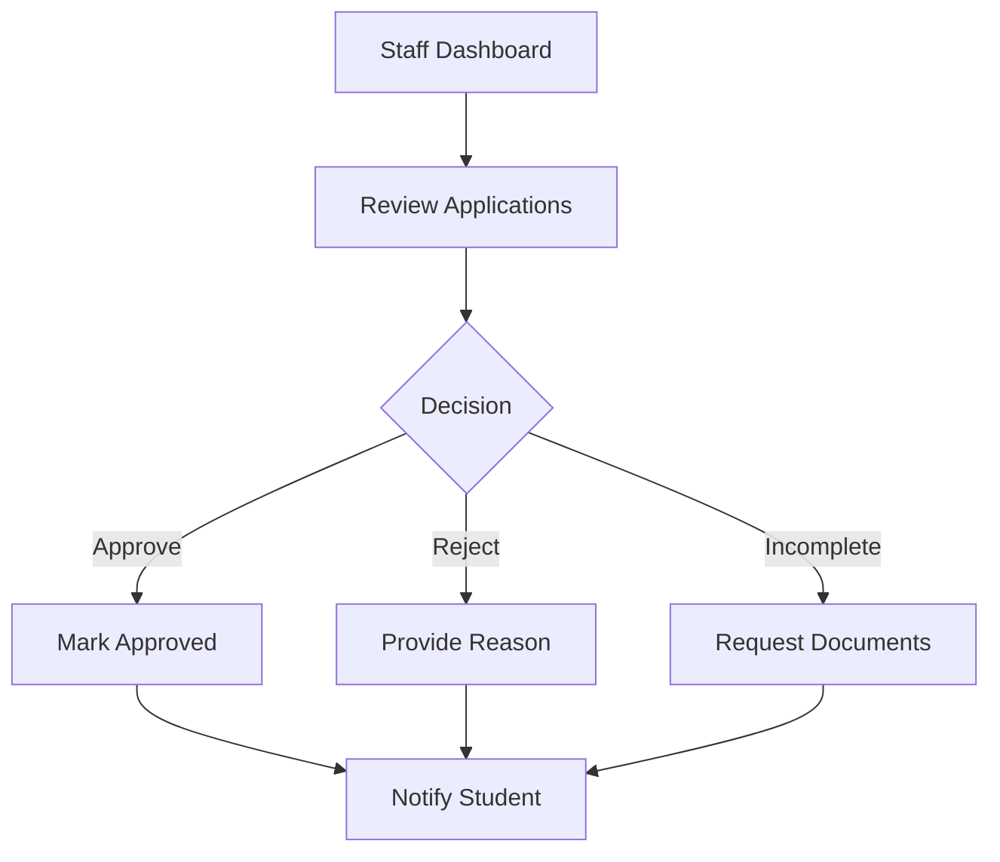

# OSAS Staff Management Documentation

The `OsasStaffController` is the central hub for scholarship administration and student oversight.

## Key Features

### 1. Application Lifecycle Management
The controller manages the transitions of scholarship applications through various states:
- `scholarshipApplications()`: Filters and displays applications for staff review.
- `reviewApplication()`: Provides a detailed view of a single application, including document status and comments.
- `updateApplicationStatus()`: Handles the logic for approving, rejecting, or requesting more information on applications.

### 2. Student & Scholarship Records
- `studentRecords()` & `getStudentDetails()`: Manage the student database, allowing staff to view academic history and personal profiles.
- `scholarshipRecords()`: Interface for CRUD operations on scholarship programs.

### 3. Application Timeline
The `buildApplicationTimeline()` method generates a chronological sequence of events for an application, helping staff understand the history of verification, evaluation, and status changes.

### 4. Data Export
- `exportApplications()`: Generates CSV/Excel exports of filtered application data for external reporting.

## Workflow Overview

---

> [!TIP]
> Use the `buildApplicationTimeline` method for debugging application flow issues.
