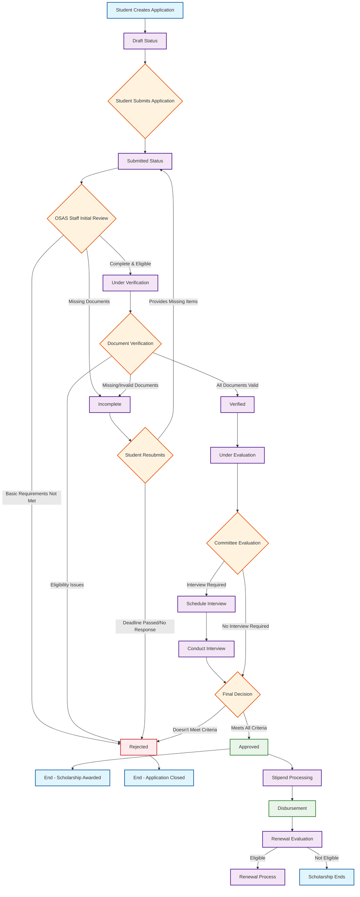
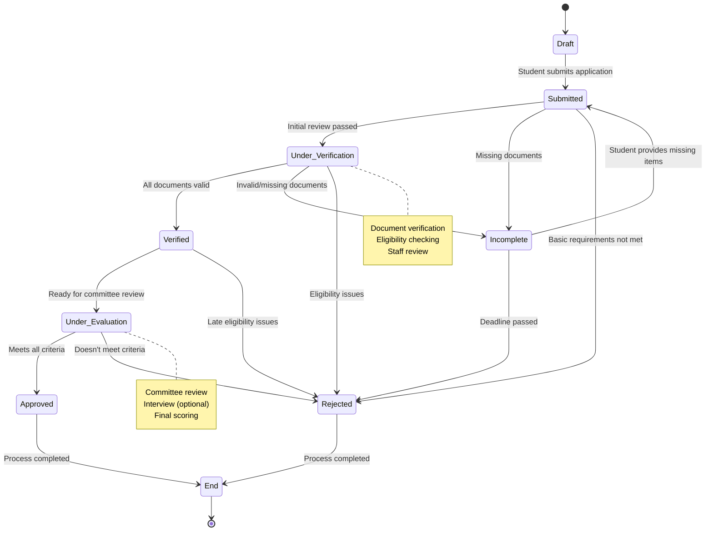

# Scholarship Application Process Flow

## Overview
This diagram shows the complete flow of scholarship applications in the OSAS Connect system, based on the status transitions defined in the `ScholarshipApplication` model.

## Mermaid Diagram



## Status Definitions

### Main Application Statuses
- **Draft**: Application being prepared by student
- **Submitted**: Complete application submitted for review
- **Under Verification**: OSAS staff verifying documents and eligibility
- **Incomplete**: Missing documents or information required
- **Verified**: All documents and eligibility confirmed
- **Under Evaluation**: Committee reviewing and evaluating application
- **Approved**: Application approved for scholarship award
- **Rejected**: Application denied
- **End**: Final status, no further transitions

### Priority Levels
- **Urgent**: Requires immediate attention
- **High**: High priority applications
- **Medium**: Standard priority
- **Low**: Lower priority

## Key Validation Points

### Document Verification (`areDocumentsComplete()`)
- Checks if all required documents are uploaded
- Validates document authenticity and completeness
- Staff can verify individual documents

### Eligibility Criteria (`meetsEligibilityCriteria()`)
The system checks various scholarship-specific criteria:
- **Academic Full/Partial**: GWA requirements, course load, grades
- **Student Assistantship**: Units enrolled, screening completion
- **Performing Arts**: Group membership, performance participation
- **Economic Assistance**: Financial need, indigency certification

### Status Transition Rules (`canTransitionTo()`)
- **Draft** → Submitted only
- **Submitted** → Under Verification, Incomplete, or Rejected
- **Under Verification** → Verified, Incomplete, or Rejected
- **Incomplete** → Submitted or Rejected
- **Verified** → Under Evaluation or Rejected
- **Under Evaluation** → Approved or Rejected
- **Approved/Rejected** → End

## Additional Features

### Timeline Tracking
- `buildApplicationTimeline()` creates audit trail
- Timestamps for each status change
- Reviewer and comments tracking

### Interview Management
- Optional interview scheduling
- Interview notes and scoring
- Integration with evaluation process

### Stipend Management
- Stipend status tracking (pending, processing, released)
- Disbursement history
- Renewal eligibility assessment

### Reporting and Analytics
- Application statistics by status
- Performance metrics and trends
- Export functionality for reports
```

## Detailed State Diagram


